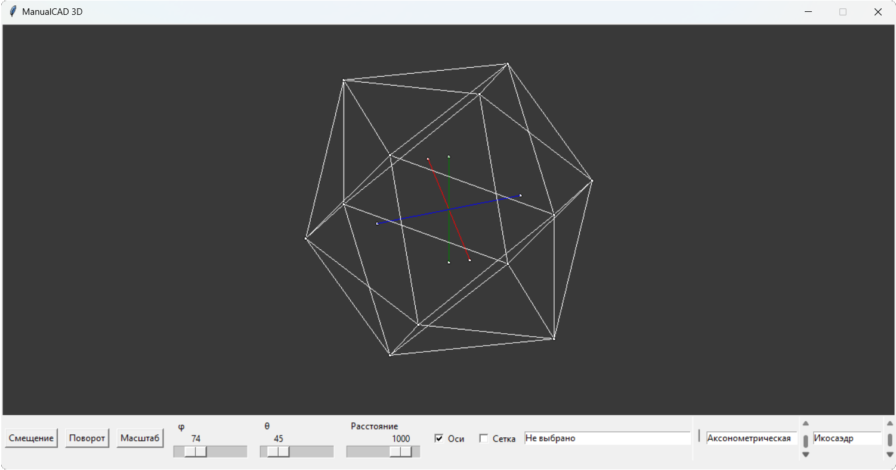

# Лабораторная работа №6. Аффинные преобразования в пространстве. Проецирование
## Задание
В программе должны присутствовать следующие классы: точка, прямая (ребро), многоугольник (грань), многогранник.

Программа должна содержать следующие возможности:

- Отображение одного из правильных многогранников: тетраэдр, гексаэдр, октаэдр, икосаэдр*, додекаэдр*.
- Применение аффинных преобразований: смещение, поворот, масштаб, с указанием параметров преобразования.
- Отражение относительно выбранной координатной плоскости.
- Масштабирование многогранника относительно своего центра.
- Вращение многогранника вокруг прямой проходящей через центр многогранника, параллельно выбранной координатной оси.
- Поворот вокруг произвольной (заданной координатами двух точек) прямой на заданный угол.

Предусмотреть возможность переключения между проекциями:
- перспективной;
- аксонометрической

## Демонстрация работы

